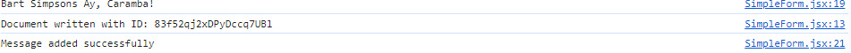
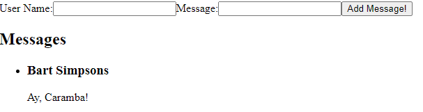

# Next.js Firestore Integration

## Objective

To integrate Firestore into a Next.js application, demonstrating the ability to add new data to Firestore and display this data within the application. This exercise focuses on initializing Firestore, simple data modeling, and executing create and read operations.

## Project Overview

This project demonstrates the integration of Firestore into a Next.js application, showcasing the ability to add new data to Firestore and display this data within the application.

## Integration Process

### Firestore Setup

1. **Create a Firebase Project :**
   - Go to the Firebase Console
   - Click on `Add Project` and follow the instructions to create a new project.
2. **Set up Firestore Database :**
   - In the newly created project, click on `Build` then `Firestore Database` located in the left sidebar.
   - Click the `Create database` button, and choose preferred location.
   ```
   Note: The location cannot be changed after set.
   ```
   - Start in `test mode` and click `create`.
3. **Get Firebase Configuration :**
   - In the left sidebar click `Project Overview`.
   - Under project title click ont the web app icon (</>) to add a new web app.
   - Register your app by giving it a nickname and click `Register App`.
   - Copy the Firebase configuration object provided.
4. Install Firebase SDK:
   - In the Next.js project directory, install the Firebase SDK by running:
   ```bash
   npm install firebase
   ```
5. **Initialize Firebase :**
   - Create a file named `firebaseConfig.js`.
   - Paste the Firebase configuration object you copied earlier into this file.

### Adding Data to Firestore

`SimpleForm` component allows users to input their name and message. `useState` hook manages the state of the form inputs. When a user submits the form, the `handleSubmit` function prevents default form submission behavior. It then adds a new document to the Firestor collection named 'messages' using Firestore SDK's `addDoc` method. If the addition is successful, a confirmation message is displayed in the console.

### Displaying Data from Firestore

`DataDisplay` component shows messages fetched from the Firestore collection 'messages'. `useState` hook manages the state for the messagesArray. When it mounts, `useEffect` hook fetches messages from Firestore. Inside the `fetchMessages` function, Firestore SDK's methods - `collection` & `getDocs` are used to query documents from the 'messages' collection. Retrieved documents are then transformed into an array of message objects, with each object containing the message ID and relevant data. This array is then set to the component's state to enable seamless rendering. Utilizing the `map` function, the messages are presented in a list format. Each message item displays the user's name and message.

## Challenges

One challenge I faced was attempting to map over the data to display on the page from the `DataDisplay` component. Initially, I attempted to pass the `useState` for `messages` through props to each component, but I encountered an error. Therefore, I removed it as props and reinstated the `useState` back into each component. This adjustment was necessary because in the `SimpleForm` component, I required the `useState` to be a string, while in the `DataDisplay`, I needed it to be an array.

## Screenshots

### Console



### Page Display



This is a [Next.js](https://nextjs.org/) project bootstrapped with [`create-next-app`](https://github.com/vercel/next.js/tree/canary/packages/create-next-app).

## Getting Started

First, run the development server:

```bash
npm run dev
# or
yarn dev
# or
pnpm dev
# or
bun dev
```

Open [http://localhost:3000](http://localhost:3000) with your browser to see the result.

You can start editing the page by modifying `app/page.js`. The page auto-updates as you edit the file.
